# NIM CLI Detailed Usage

## 0. Introduction

NIM CLI is a command-line tool for managing NVIDIA NIM containers — pull, run, stop, and list NIMs with ease.

Key features:
- **CND Support (China NIM Distributor):** Seamlessly connect to and switch between NGC mirrors in China, simplifying access to NIM images.
- **Agent Integration:** The `nim launch <agent>` command installs, configures, and starts an Agent in one step, automatically connecting it to your local NIM.

## 1. Install NIM CLI

```bash
curl -fsSL https://raw.githubusercontent.com/LuYanFCP/nim-go-release/main/install.sh | bash
```

**For users located in China:**

```bash
curl -fsSL https://v6.gh-proxy.org/https://raw.githubusercontent.com/LuYanFCP/nim-go-release/refs/heads/main/install.sh | bash
```

Verify the installation:

```bash
nim --help
```

Update to the latest version:

```bash
sudo nim update
```
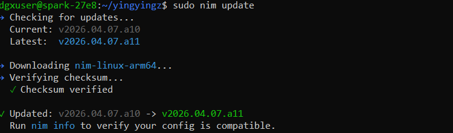

## 2. Choose where to download

In China, NIM images are distributed via CND (China NIM Distributor). Available CNDs: `tgcr`, `turingcm`, `lichan`.

> **Note:** Spark NIMs do not require authentication from any of these CNDs.

```bash
nim config registry list
```
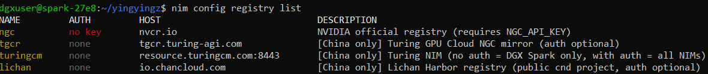

#### Scenario 1: In China

Set any CND as the default. For example, `tgcr` offers the fastest download speed:

```bash
nim config registry default tgcr
```

#### Scenario 2: Outside China

Set `ngc` or `tgcr` as the default.

> If you choose `ngc`, an NVIDIA API key is required. See [NGC Quick Start](./ngc-quick-start.md).


## 3. Search for NIM Containers

```bash
nim search <query>
```

Example — searching for Qwen3.5:
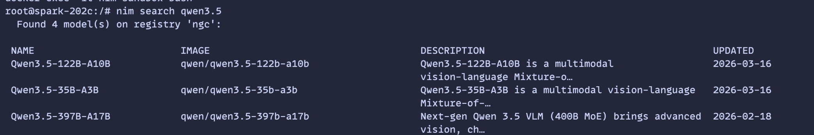

## 4. Pull and Run a NIM

Copy the image name from the search results to pull and run it:

```bash
nim pull qwen/qwen3.5-35b-a3b
nim run qwen/qwen3.5-35b-a3b --port 8001 # Specify port 8001; defaults to 8000 if omitted
```

> `nim run` works like `docker run` — if the image is not found locally, it will be pulled automatically. Port defaults to 8000 if `--port` is omitted.

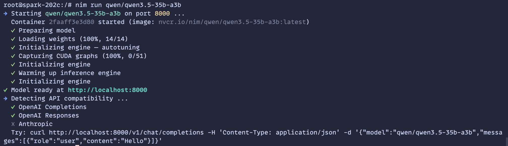

## 5. Launch Claude Code

```bash
nim launch claude-code --model qwen/qwen3.5-35b-a3b --port 8001
nim launch claude-code  # use a locally running NIM
```

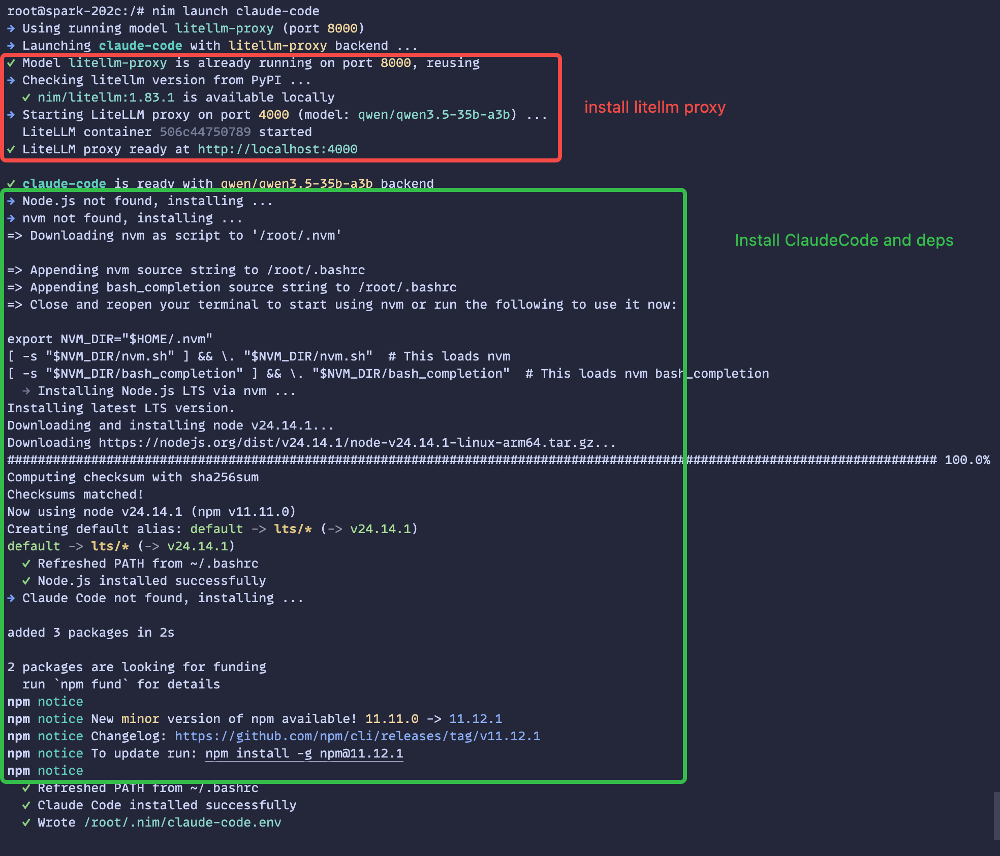

Then start Claude Code:

```bash
source /root/.nim/claude-code.env && claude
```

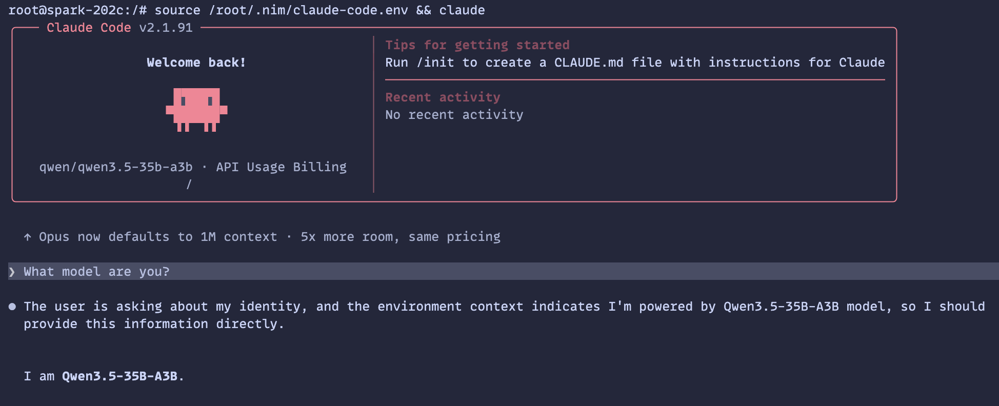


## 6. Launch OpenClaw

```bash
nim launch openclaw --model qwen/qwen3.5-35b-a3b --port 8001
nim launch openclaw                # use a locally running NIM
nim launch openclaw --with-wechat  # auto-install and configure the WeChat plugin
nim launch openclaw --with-feishu  # auto-install and configure the Feishu plugin
nim launch openclaw --run          # start the OpenClaw gateway and TUI
nim launch openclaw --websearch    # configure OpenClaw web search interactively, supporting Kimi Search, MiniMax Search, Tavily
```

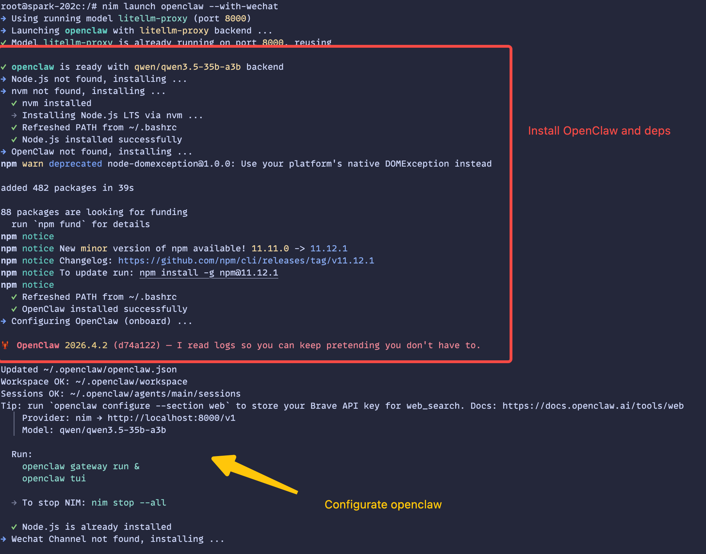
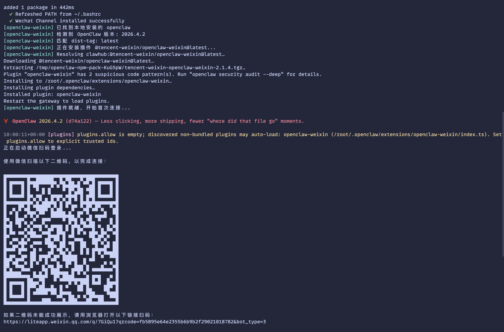

WeChat connection:

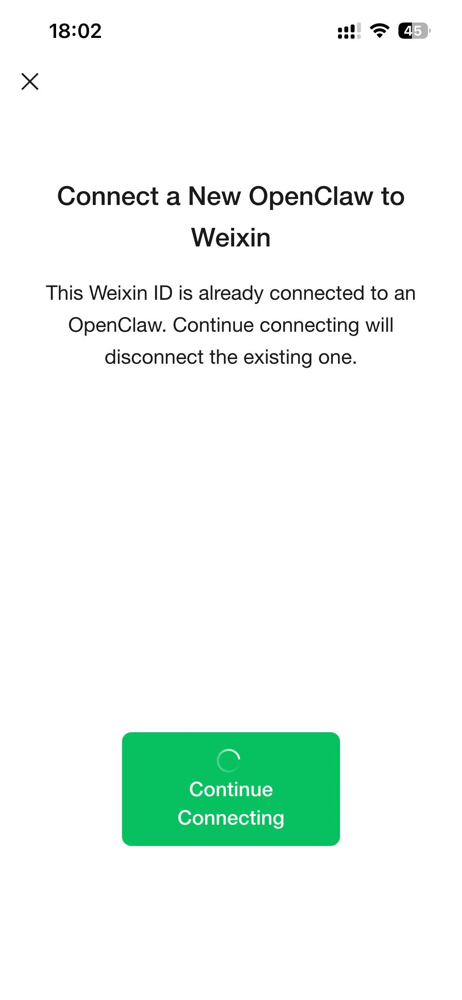
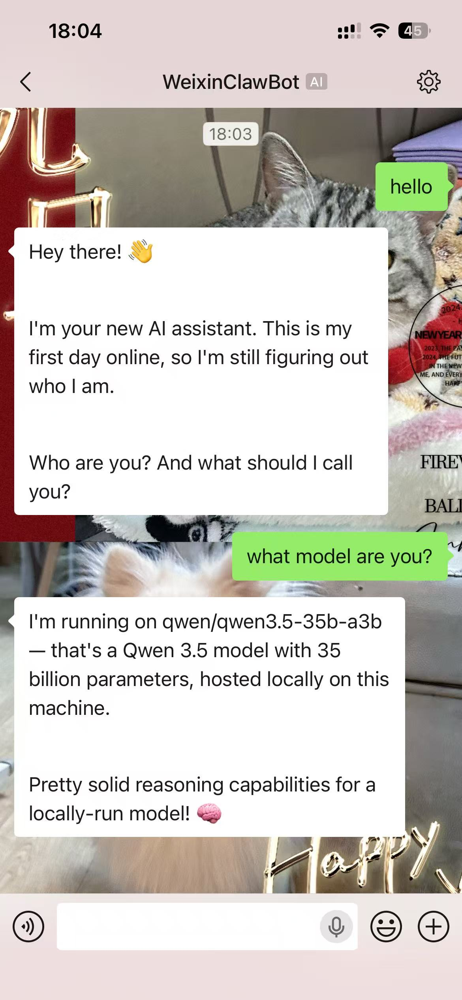

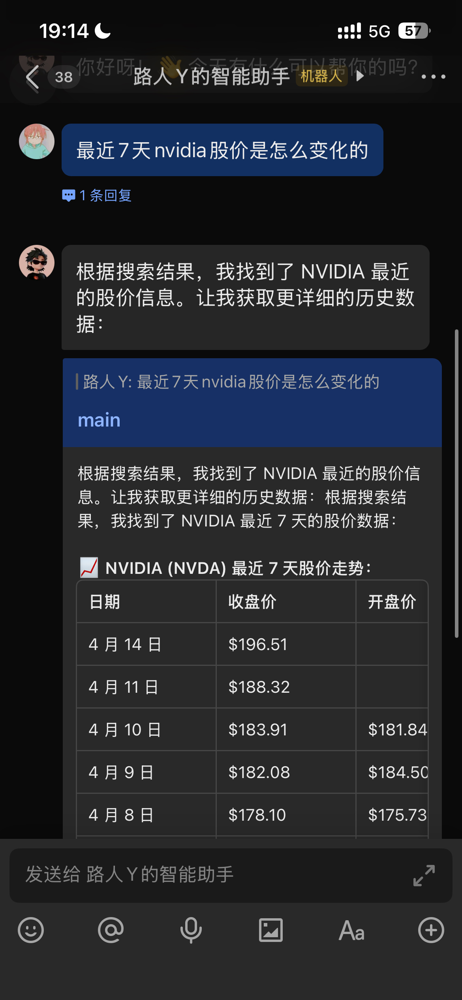
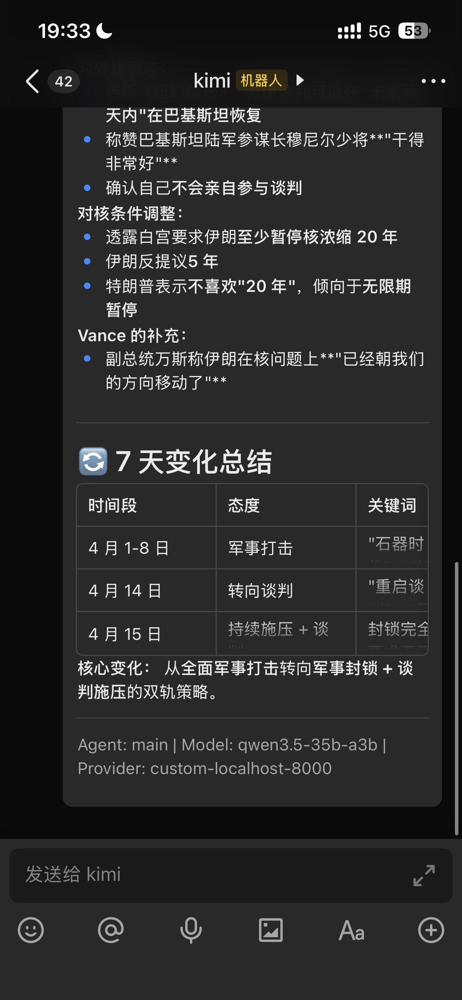

## 7. Troubleshooting

If you encounter the following error:

```
Error: Docker error: Docker responded with status code 401: unauthorized: project nim not found
```

Run diagnostics:

```bash
nim diag
```

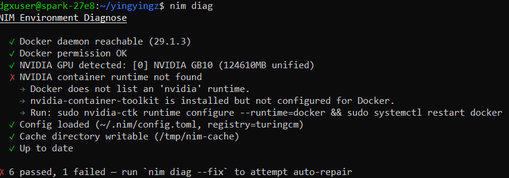

Auto-fix the issue:

```bash
nim diag --fix
```

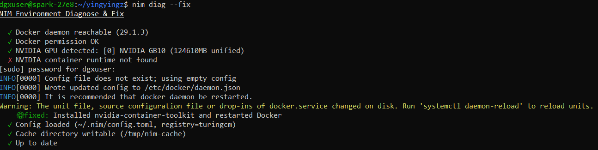
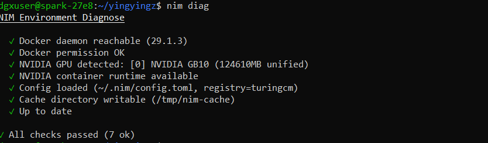
