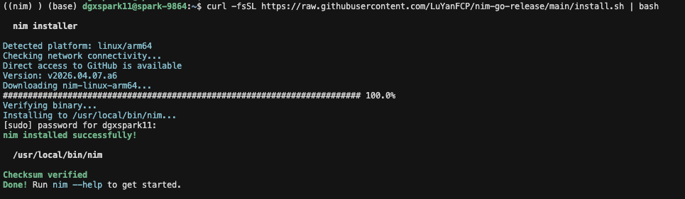
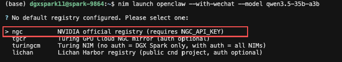
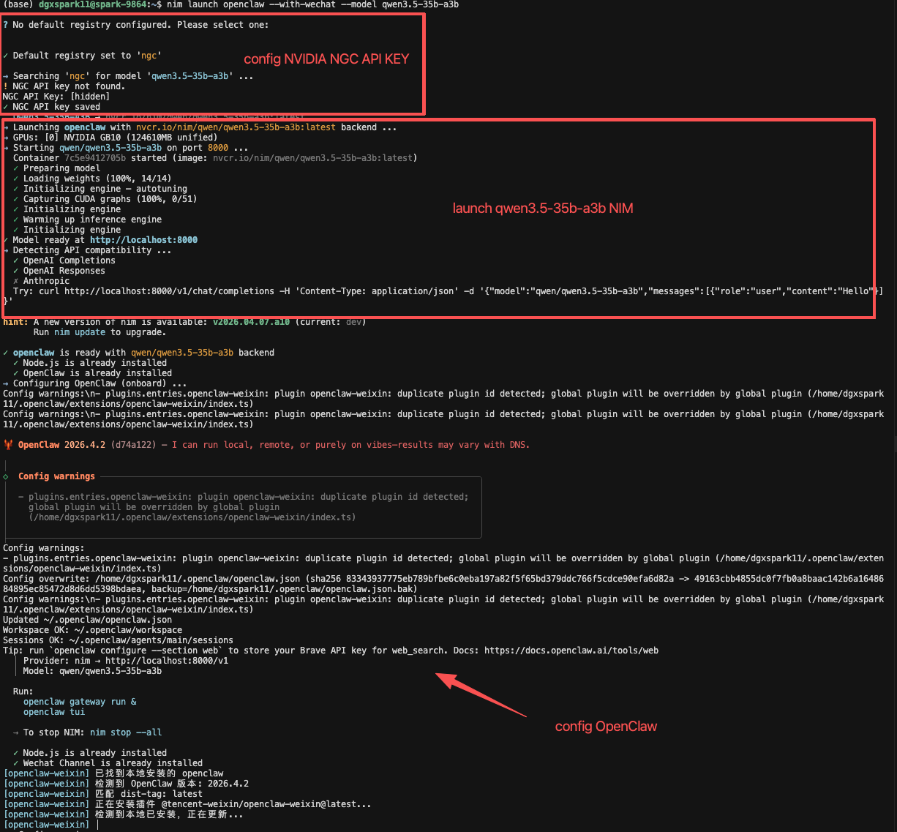
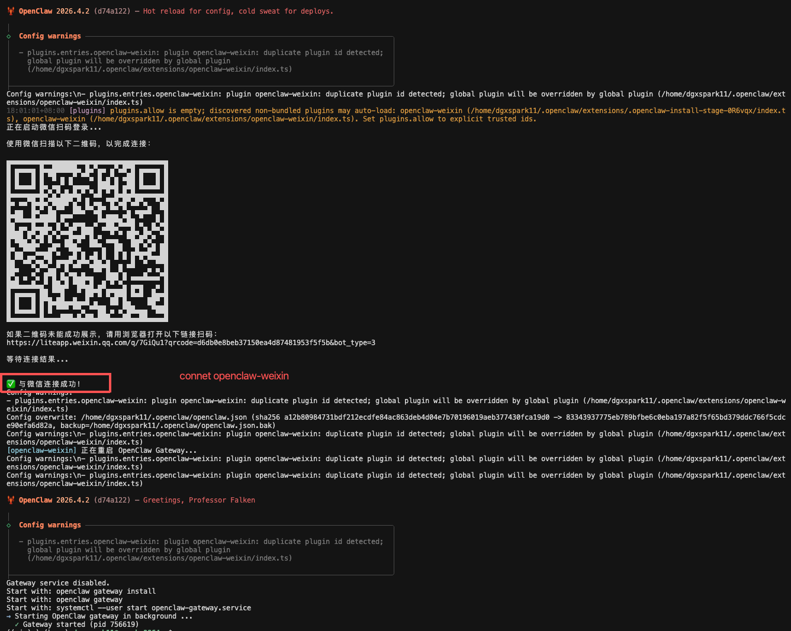
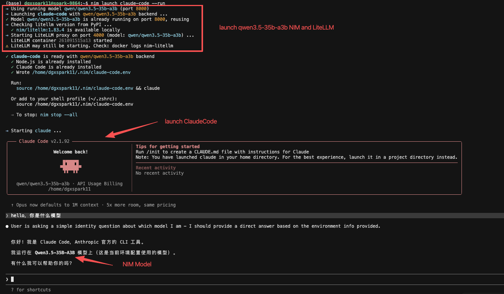
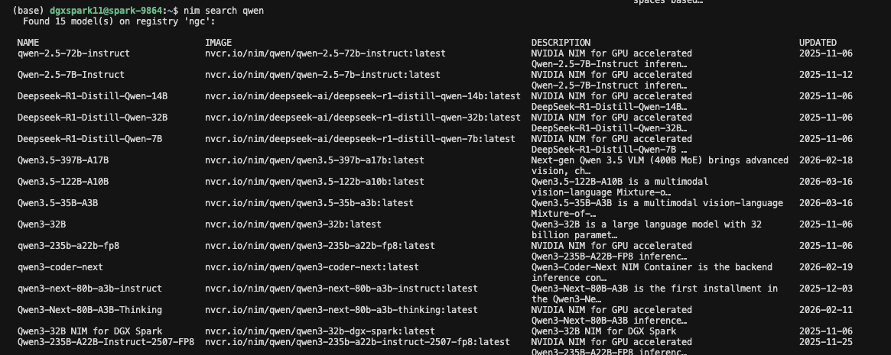
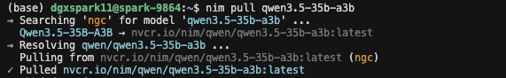
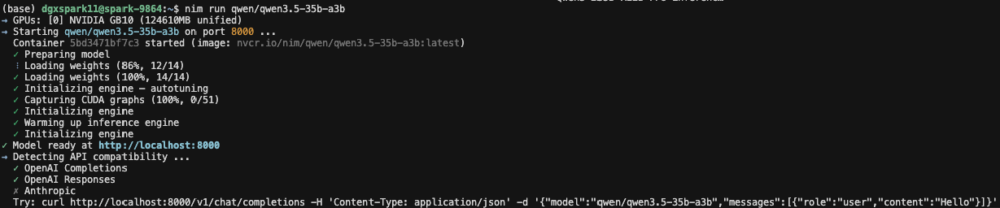

# 使用 NGC 快速开始
**推荐非中国网络环境用户使用本方式。**
## 0. 获取 API Key
运行 NIM 需要配置 NVIDIA API Key，并通过 `NVIDIA_API_KEY` 环境变量提供。你可以在 [build.nvidia.com](https://build.nvidia.com) 注册账号后创建 API Key。

## 1. 安装 NIM CLI
```bash
curl -fsSL https://raw.githubusercontent.com/LuYanFCP/nim-go-release/main/install.sh | bash
```

**国内用户：**

```bash
curl -fsSL https://v6.gh-proxy.org/https://raw.githubusercontent.com/LuYanFCP/nim-go-release/refs/heads/main/install.sh | bash
```
<details>
<summary>安装 NIM CLI</summary>



</details>

## 2a. 启动 OpenClaw，由 NIM 提供模型支持

```bash
nim launch openclaw --with-wechat --model qwen3.5-35b-a3b
```
<details>
<summary>使用 NGC 配置镜像源</summary>



</details>
<details>
<summary>启动 OpenClaw（1）</summary>



</details>
<details>
<summary>启动 OpenClaw（2）</summary>



</details>


## 2b. 启动 Claude Code，由 NIM 提供模型支持

```bash
nim launch claude-code --run
```
<details>
<summary>启动 Claude Code</summary>



</details>


## 2c. 仅使用 NIM
### 搜索 NIM 模型
```bash
nim search qwen
```
<details>
<summary>执行 `nim search qwen` 按关键词搜索 NIM</summary>



</details>

### 拉取 NIM 镜像（可跳过手动执行，默认包含在“运行 NIM”中）
```bash
nim pull qwen3.5-35b-a3b
```

<details>
<summary>拉取对应的 NIM 镜像</summary>



</details>

### 运行 NIM
```bash
nim run qwen3.5-35b-a3b
```

<details>
<summary>启动 NIM</summary>



</details>
