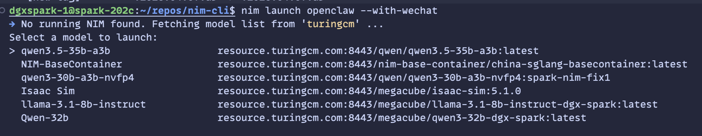

# Quick Start

Detailed documentation: [How to Use (Chinese)](./how-to-use-detail-zh.md) | [How to Use (English)](./how-to-use-detail.md)

## 1. Install Nim CLI
```bash
curl -fsSL https://raw.githubusercontent.com/LuYanFCP/nim-go-release/main/install.sh | bash
```

**China / 国内用户：**

```bash
curl -fsSL https://v6.gh-proxy.org/https://raw.githubusercontent.com/LuYanFCP/nim-go-release/refs/heads/main/install.sh | bash
```

## 2. Launch a NIM with OpenClaw

```bash
nim launch openclaw --with-wechat
```



## 2. Launch a NIM with Claude Code

```bash
nim launch claude-code --run 
```
