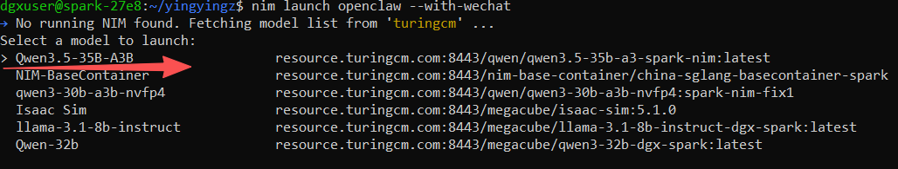
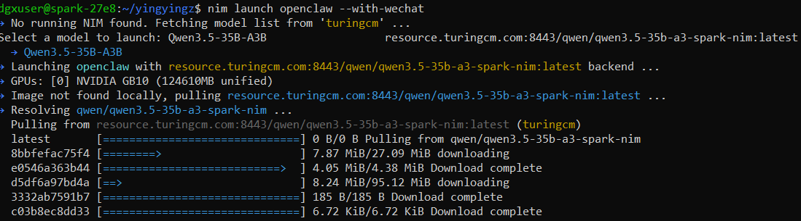
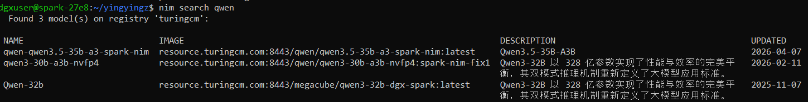
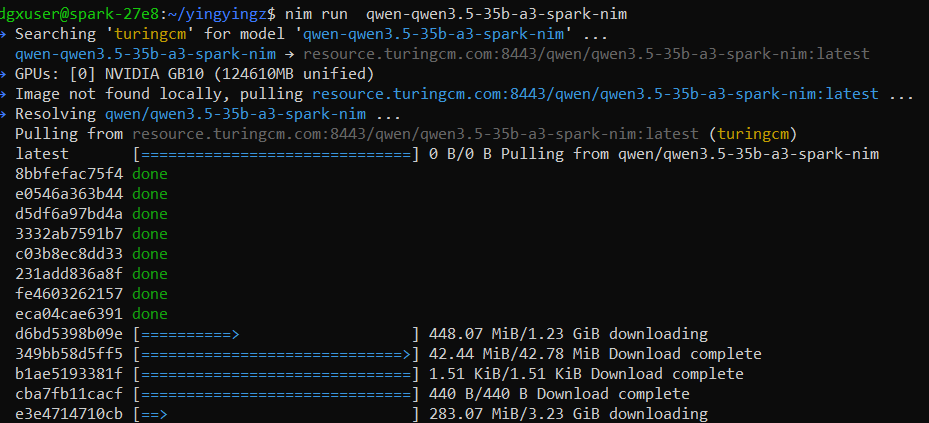

# Quick Start

## Step 1. Install NIM CLI

```bash
curl -fsSL https://raw.githubusercontent.com/LuYanFCP/nim-go-release/main/install.sh | bash
```

Verify your installation

```bash
nim --help
```

If you have installed the NIM CLI before, update to the latest version

```bash
sudo nim update
```


## Step 2. Choose where to download

In China, we distribute NIM via CND (China NIM Distributor). We have Three CNDs: ```tgcr```, ```turingcm```, ```lichan```
For __Spark NIMs__, authentication is not required from these 3 CNDs

```bash
nim config registry list
```


#### Scenario 1: if you're in China

Choose any of these 3 CND as the default. e.g., if you want to achieve the fastest downloading speed, choose ```tgcr```, if you want to use the latest spark NIM ```qwen3.5-35b-a3b```, choose ```turingcm```

```bash
nim config registry default turingcm
```

#### Scenario 2: if you're outside China

Choose either ```ngc``` or ```tgcr```.

If you choose ```ngc```, NVAIE API Key is required later.
Depending on which workflows you are running, you may need to obtain API keys from the respective services. NI require an NVIDIA API key defined with the NVIDIA_API_KEY environment variable. An API key can be obtained by creating an account on [build.nvidia.com](https://build.nvidia.com).

[Ngc quick start](./ngc-quick-start.md)


## Step 3. Launch a NIM with OpenClaw or Claude Code

```bash
nim launch openclaw
```

If you want to use wechat to send instructions to the openclaw

```bash
nim launch openclaw --with-wechat
```
The command will install OpenClaw, and in the meanwhile, it will ask the user to choose a model from the registry you earlier chose.




If you want to use Claude Code as the code agent

```bash
nim launch claude-code --run 
```

## Only run NIM

### Step 1: Find the NIMs on your chosen registry

Must provide a name, not necessarily complete. NIM CLI supports fuzzy search, e.g.,

```bash
nim search qwen
```




### Step 2: Run a NIM

Provide either the model name or the image name. This example uses ```qwen-qwen3.5-35b-a3-spark-nim``` on the registry ```turingcm```

```bash
nim run qwen-qwen3.5-35b-a3-spark-nim
```




# Trouble Shooting

You may encounter the errors below

```
Error: Docker error: Docker responded with status code 401: unauthorized: project nim not found: project nim not found

Caused by:
    Docker responded with status code 401: unauthorized: project nim not found: project nim not found
```
Run Diagnose

```bash
nim diag
```


Fix the issue

```bash
nim diag --fix
```


