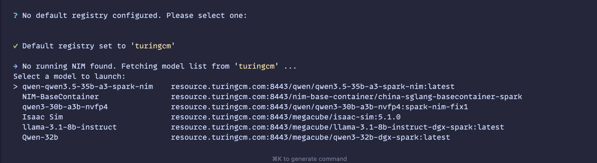
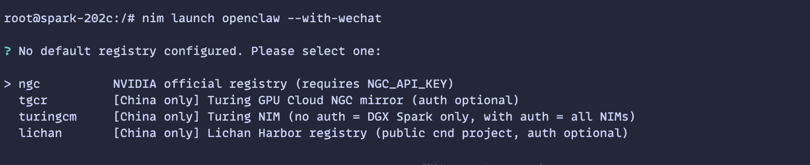

# 快速开始

## 第 1 步：安装 NIM CLI

```bash
curl -fsSL https://raw.githubusercontent.com/LuYanFCP/nim-go-release/main/install.sh | bash
```

## 第 2 步：启动 OpenClaw 或 Claude Code，由 NIM 提供模型支持


**OpenClaw：**

```bash
nim launch openclaw
```

**Claude Code：**

```bash
nim launch claude-code --run
```

该命令会引导你以交互方式选择一个镜像源和模型。

> 在中国，请选择 CND（图灵新智算`tgcr`、图灵模镜`turingcm` 或 丽蟾`lichan`），我们推荐使用 `tgcr` 以获得最快速度。Spark NIMs 无需认证。




更多详情请参阅[高级用法](./advanced-usage_cn.md)。
